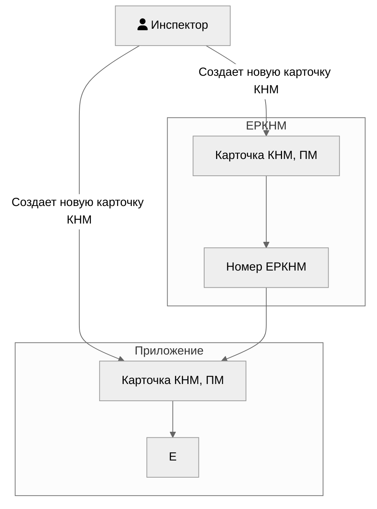
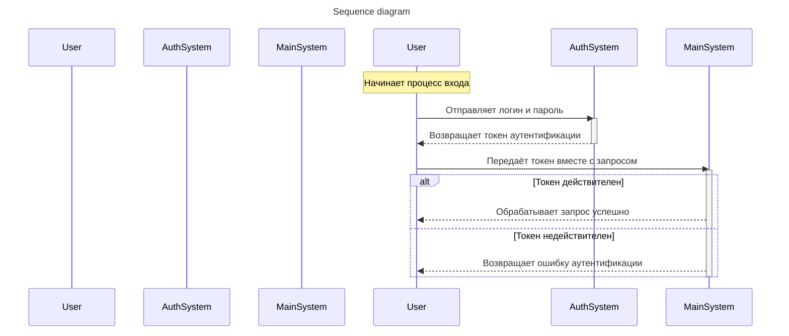

# Блок-схемы

```mermaid
---
config:
    theme: neutral
---

flowchart TB

A[fa:fa-user Инспектор ]
A-- Создает новую карточку КНМ -->D
A-- Создает новую карточку КНМ -->B

subgraph ЕРКНМ
direction TB
    B[Карточка КНМ, ПМ]-->C[Номер ЕРКНМ]
end

subgraph Приложение
direction TB
    D[Карточка КНМ, ПМ]-->E
end

C-->D

```

```mermaid
---
title: Sequence diagram
---

sequenceDiagram
    participant Пользователь as User
    participant СистемаАвторизации as AuthSystem
    participant ОсновнаяСистема as MainSystem

    Note over User: Начинает процесс входа

    User->>AuthSystem: Отправляет логин и пароль
    activate AuthSystem
    AuthSystem-->>User: Возвращает токен аутентификации
    deactivate AuthSystem

    User->>MainSystem: Передаёт токен вместе с запросом
    activate MainSystem
    alt Токен действителен
        MainSystem-->>User: Обрабатывает запрос успешно
    else Токен недействителен
        MainSystem-->>User: Возвращает ошибку аутентификации
    end
    deactivate MainSystem

```
