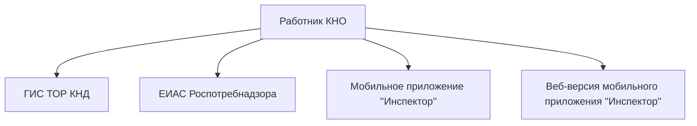
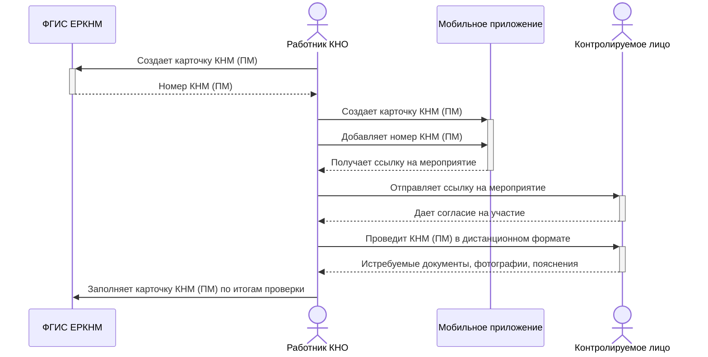
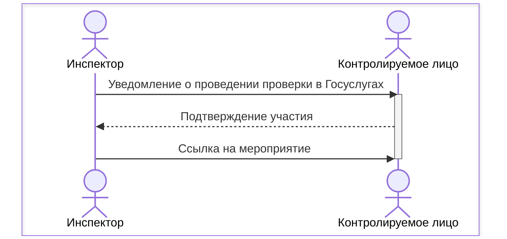

# Взаимодействие ЕРКНМ и мобильного приложения "Инспектор"

## Содержание

<!-- @import "[TOC]" {cmd="toc" depthFrom=1 depthTo=6 orderedList=false} -->

<!-- code_chunk_output -->

- [Взаимодействие ЕРКНМ и мобильного приложения "Инспектор"](#взаимодействие-еркнм-и-мобильного-приложения-инспектор)
  - [Содержание](#содержание)
  - [Возможности приложения](#возможности-приложения)
  - [Преимущества приложения](#преимущества-приложения)
  - [Общая схема работы](#общая-схема-работы)
  - [Схема взаимодействия работника КНО, ЕРКНМ и контролируемого лица при создании КНМ (ПМ)](#схема-взаимодействия-работника-кно-еркнм-и-контролируемого-лица-при-создании-кнм-пм)
  - [Создание мероприятия в приложении "Инспектор"](#создание-мероприятия-в-приложении-инспектор)
  - [Взаимодействие с контролируемым лицом](#взаимодействие-с-контролируемым-лицом)

<!-- /code_chunk_output -->

<!-- pagebreak -->

## Возможности приложения

- Фиксация нарушения на фото и видео
- Мероприятия с чек-листом и без него
- Дистанционное взаимодействие (ВКС)
- Контроль подмены геолокации
- Формирование результатов (акты и др.)
- Подписание результатов в "Госключ" (УНЭП, УКЭП и УКЭП должностного лица)

<!-- pagebreak -->

## Преимущества приложения

- Проверка
    - Проведение ВКС с использованием мобильной камеры контролируемого лица и возможностью использовать проверочный лист (чек-лист) для фиксации результатов проверки, которые отображаются у инспектора, и у контролируемого лица

- Формирование результатов проверки
    - В приложении формируется файл печатной формы журнала ВКС:
        - общая информация о мероприятии
        - детализация действий участников ВКС
        - ответы на вопросы проверочного листа
        - сообщения из чата участников ВКС
        - ссылки на файлы из чата участников

- Геолокация
    - В режиме реального времени инспектору доступно местоположение устройства, контролируемого лица и отслеживание перемещений проверяемого во время проверки.    
    - При попытке подменить координаты сторонним программным обеспечением инспектор увидит предупреждение.
    - В случае сбоя геолокации рекомендуется продолжить мероприятие и предложить контролируемому лицу продемонстрировать адресную табличку с названием улицы и номером дома.
- История проверок
    - Доступ к базе данных в мобильном приложении по объектам, нарушениям и предыдущим проверкам, что позволяет инспекторам иметь полную картину ситуации.
- Коммуникация
    - Возможность обмениваться сообщениями и материалами с контролируемым лицом в чате (сообщения, фото, видео, сканы документов), что способствует более эффективному взаимодействию (при проведении ВКС и устранении контролируемым лицом ранее выявленных нарушений).
- Уведомления
    - Уведомление о новых и напоминания о предстоящих мероприятиях доступны для пользователей за 7 дней, 1 день и час до начала.
- Интеграция с другими системами
    - Возможность интеграции с ведомственными информационными системами (ВИС), что позволяет инспектору создать мероприятие в ВИС в привычном формате и затем использовать мобильное приложение для проведения проверки.
    > **На данный момент интеграция приложения с ЕИАС Роспотребнадзора не реализована**
- Цифровые проверочные листы
    - Инспектор выбирает готовый шаблон проверочного листа и отвечает на вопросы, отмечая соблюдение или нарушение требований.

    - При выборе ответа на вопрос проверочного листа инспектором, на экране ВКС у контролируемого лица появляется push-уведомление с выбранным ответом на вопрос.

        - <i class="fa fa-square-check" style="color: green;"></i> если выбран ответ "да"
        - <i class="fa fa-square-check" style="color: red;"></i> если выбран ответ "нет"
        - <i class="fa fa-square-check" style="color: gray;"></i> если выбран ответ "не применимо"
    - Проверочные листы позволяют быстро фиксировать результаты и вносить изменения во время проверки. Данные сохраняются в карточке мероприятия и синхронизируются с ГИС ТОР КНД. При необходимости ответы можно изменить.

    - Инспектор в ходе ВКС может направить чек-лист контролируемому лицу для самостоятельного заполнения. Контролируемо лицо может снимать фото и видео по чек-листу вне зоны доступа мобильной сети и после направить полученный результат инспектору.

<!-- pagebreak -->

## Общая схема работы

Создание мероприятия возможно 4 способами:
1. ГИС ТОР КНД
2. Ведомственная информационная система (ЕИАС Роспотребнадзора)
3. Мобильное приложение "Инспектор"
4. Веб-версия мобильного приложения "Инспектор"

<table align="center">

| Способ создания КНМ (ПМ) | Преимущества         | Недостатки |
| :---:           | :---:                | :---:      |
| ГИС ТОР КНД     | Не выявлено          | Нет интеграции с ЕРКНМ |
| ЕИАС            | Знакомый интерфейс   | Неполная интеграция с ЕРКНМ |
| Мобильное приложение "Инспектор" | Возможность дистанционной работы | Нестабильная работа при плохом сигнале |
| Веб-версия мобильного приложения | Возможность работы с ПК | Контролируемое лицо должно работать с мобильного телефона |
</table>

Таблица 1

<!-- pagebreak -->

## Схема взаимодействия работника КНО, ЕРКНМ и контролируемого лица при создании КНМ (ПМ)

<!-- pagebreak -->

## Создание мероприятия в приложении "Инспектор"

Рисунок 1

## Взаимодействие с контролируемым лицом

