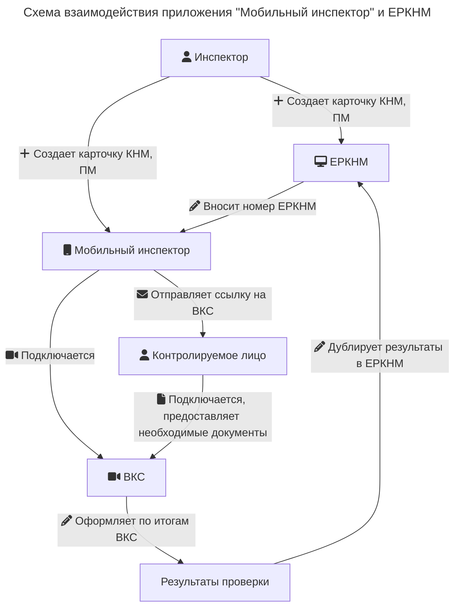

# Блок-схемы

```mermaid
---
title: Схема взаимодействия приложения "Мобильный инспектор" и ЕРКНМ
---

flowchart TD

C -- <i class="fa fa-plus"></i> Создает карточку КНМ, ПМ --> B[fa:fa-desktop ЕРКНМ]

C[fa:fa-user Инспектор] -- <i class="fa fa-plus"></i> Создает карточку КНМ, ПМ --> A[fa:fa-mobile Мобильный инспектор]


B -- <i class="fa fa-pencil"></i> Вносит номер ЕРКНМ --> A
A -- <i class="fa fa-video-camera"></i> Подключается --> E[fa:fa-video-camera ВКС]
F[fa:fa-user Контролируемое лицо]
A -- <i class="fa fa-envelope"></i> Отправляет ссылку на ВКС --> F
F -- <i class="fa fa-file"></i> Подключается, предоставляет необходимые документы --> E
E -- <i class="fa fa-pencil"></i> Оформляет по итогам ВКС --> G[Результаты проверки]
G -- <i class="fa fa-pencil"></i> Дублирует результаты в ЕРКНМ --> B
```