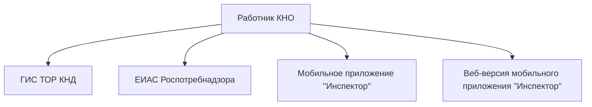
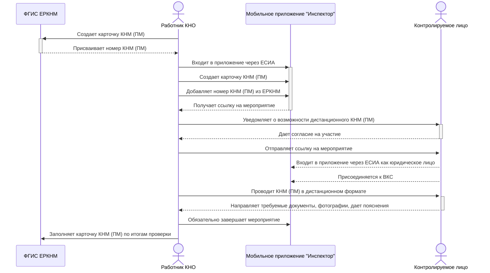
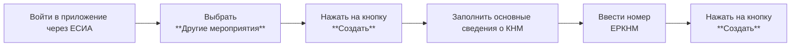
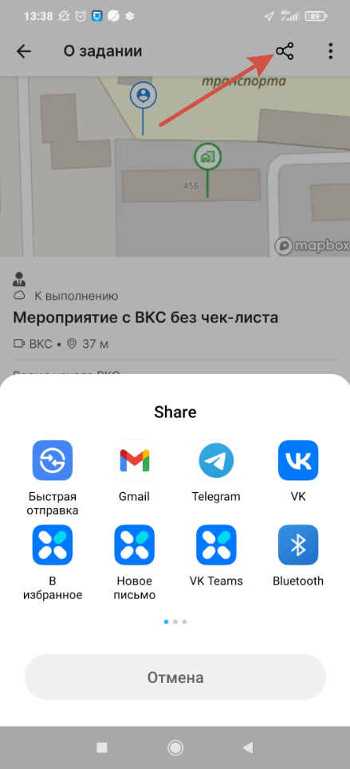

# Взаимодействие ЕРКНМ и мобильного приложения "Инспектор"

## Содержание

<!-- @import "[TOC]" {cmd="toc" depthFrom=1 depthTo=6 orderedList=false} -->

<!-- code_chunk_output -->

- [Взаимодействие ЕРКНМ и мобильного приложения "Инспектор"](#взаимодействие-еркнм-и-мобильного-приложения-инспектор)
  - [Содержание](#содержание)
  - [Возможности приложения](#возможности-приложения)
  - [Преимущества приложения](#преимущества-приложения)
  - [Способы создания мероприятия (КНМ, ПМ)](#способы-создания-мероприятия-кнм-пм)
  - [Взаимодействие работника КНО, ЕРКНМ и контролируемого лица при создании и проведении КНМ (ПМ) в мобильном приложении](#взаимодействие-работника-кно-еркнм-и-контролируемого-лица-при-создании-и-проведении-кнм-пм-в-мобильном-приложении)
  - [Порядок создания мероприятия в приложении "Инспектор"](#порядок-создания-мероприятия-в-приложении-инспектор)
  - [Порядок проведения мероприятия в формате ВКС](#порядок-проведения-мероприятия-в-формате-вкс)
  - [Полезные ссылки](#полезные-ссылки)

<!-- /code_chunk_output -->

<!-- pagebreak -->

## Возможности приложения

- Фиксация нарушения на фото и видео
- Мероприятия с чек-листом и без него
- Дистанционное взаимодействие (ВКС)
- Контроль подмены геолокации
- Формирование результатов (акты и др.)
- Подписание результатов в "Госключ" (УНЭП, УКЭП и УКЭП должностного лица)

<!-- pagebreak -->

## Преимущества приложения

- **Проверка**
    Проведение ВКС с мобильной камерой контролирующего лица, чек-листом для фиксации результатов, видимых обеими сторонами.
- **Формирование результатов проверки**
    - В приложении формируется файл печатной формы журнала ВКС: общая информация о мероприятии, детализация действий участников ВКС, ответы на вопросы проверочного листа, сообщения из чата участников ВКС, ссылки на файлы из чата участников.
- **Геолокация**
    - Во время проверки инспектор видит местоположение и перемещения контролируемого лица в реальном времени, получает уведомление о попытках изменения координат и при сбое геолокации просит показать адресную табличку.
- **История проверок**
    - Доступ к базе данных в мобильном приложении по объектам, нарушениям и предыдущим проверкам, что позволяет инспекторам иметь полную картину ситуации.
- **Коммуникация**
    - Обмен сообщениями и материалами в чате повышает эффективность взаимодействия при проверке и устранении нарушений.
- **Уведомления**
    - Уведомление о новых и напоминания о предстоящих мероприятиях доступны для пользователей за 7 дней, 1 день и час до начала.
- **Интеграция с другими системами**
    - Возможность интеграции с ведомственными информационными системами (ВИС), что позволяет инспектору создать мероприятие в ВИС в привычном формате и затем использовать мобильное приложение для проведения проверки.
    > <i style="color: red;" class="fa fa-triangle-exclamation"></i> **На данный момент интеграция приложения с ЕИАС Роспотребнадзора не реализована. Сроки реализации неизвестны.**
- **Цифровые проверочные листы**
    > <i style="color: red;" class="fa fa-triangle-exclamation"></i> **Функционал пока не запущен в промышленную эксплуатацию, ожидается до конца года.**

<!-- pagebreak -->

## Способы создания мероприятия (КНМ, ПМ)

Создание мероприятия возможно 4 способами:
1. ГИС ТОР КНД
2. Ведомственная информационная система (ЕИАС Роспотребнадзора)
3. Мобильное приложение "Инспектор"
4. Веб-версия мобильного приложения "Инспектор"

Схема 1

 

Рассмотрим преимущества и недостатки каждого из способов.

<table align="center">

| Способ создания КНМ (ПМ) | Преимущества         | Недостатки |
| :---:           | :---:                | :---:      |
| ГИС ТОР КНД     | Не выявлено          | Нет интеграции с ЕРКНМ |
| ЕИАС Роспотребнадзора | Знакомый интерфейс   | Неполная интеграция с ЕРКНМ |
| Мобильное приложение "Инспектор" | Возможность дистанционной работы | Нестабильная работа при плохом сигнале |
| Веб-версия мобильного приложения | Возможность работы с ПК | Контролируемое лицо должно работать с мобильного телефона |
</table>

Таблица 1

<!-- pagebreak -->

## Взаимодействие работника КНО, ЕРКНМ и контролируемого лица при создании и проведении КНМ (ПМ) в мобильном приложении

Схема 2

<!-- pagebreak -->

## Порядок создания мероприятия в приложении "Инспектор"

Создание КНМ (ПМ) в приложении "Инспектор" осуществляется по схеме 3:

Схема 3

Уведомление о предстоящем мероприятии появляется в приложении у контролируемого лица. Также можно дополнительно уведомить контролируемое лицо о запланированном мероприятии, войдя в мероприятие и поделившись ссылкой любым доступным способом (Рисунок 1).

Рисунок 1

<!-- pagebreak -->

## Порядок проведения мероприятия в формате ВКС

<!-- pagebreak -->

## Полезные ссылки

- Очистка кэша приложения в Android: https://cloud.mail.ru/public/WNZN/gUa2mwWv2
QR код для скачивания

<!-- pagebreak -->