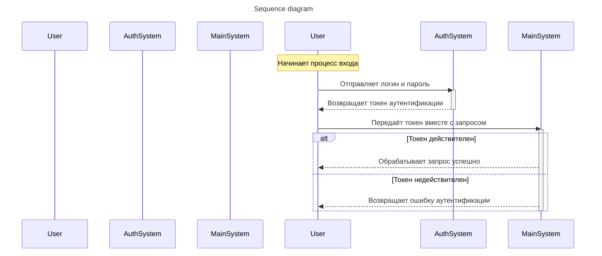
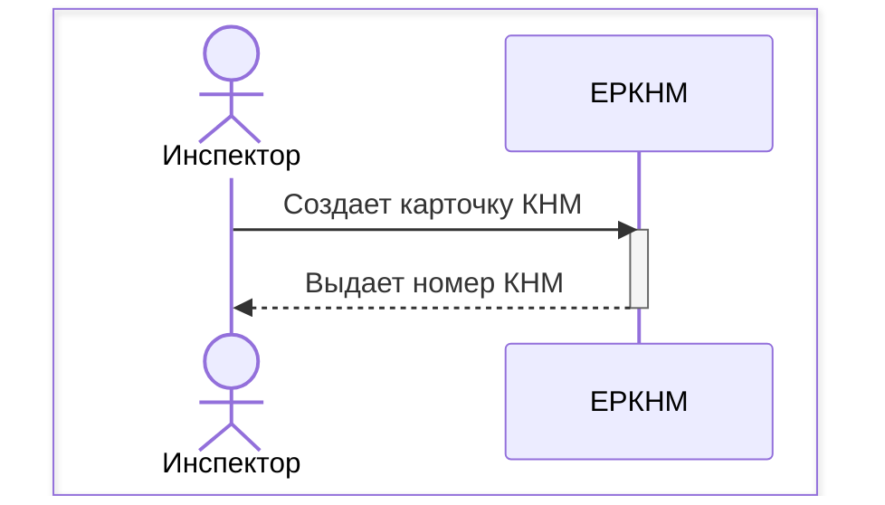
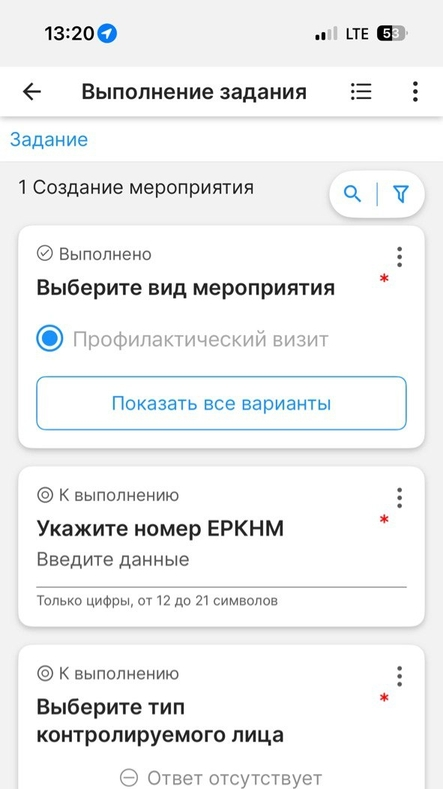
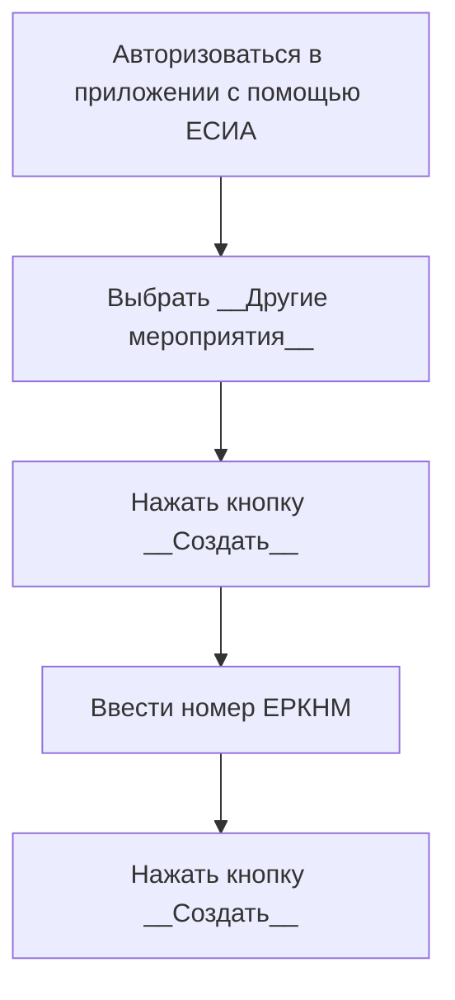
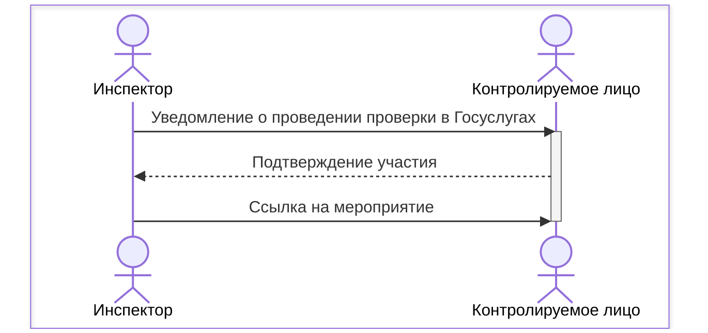

# Взаимодействие ЕРКНМ и приложения "Мобильный инспектор"

## Содержание

<!-- @import "[TOC]" {cmd="toc" depthFrom=1 depthTo=6 orderedList=false} -->

<!-- code_chunk_output -->

- [Взаимодействие ЕРКНМ и приложения "Мобильный инспектор"](#взаимодействие-еркнм-и-приложения-мобильный-инспектор)
  - [Содержание](#содержание)
  - [sequence sample](#sequence-sample)
  - [Создание паспорта КНМ (ПМ) в ЕРКНМ](#создание-паспорта-кнм-пм-в-еркнм)
  - [Создание карточки КНМ в приложении "Мобильный инспектор"](#создание-карточки-кнм-в-приложении-мобильный-инспектор)
  - [Взаимодействие с контролируемым лицом](#взаимодействие-с-контролируемым-лицом)

<!-- /code_chunk_output -->

## sequence sample

## Создание паспорта КНМ (ПМ) в ЕРКНМ

## Создание карточки КНМ в приложении "Мобильный инспектор"

## Взаимодействие с контролируемым лицом

