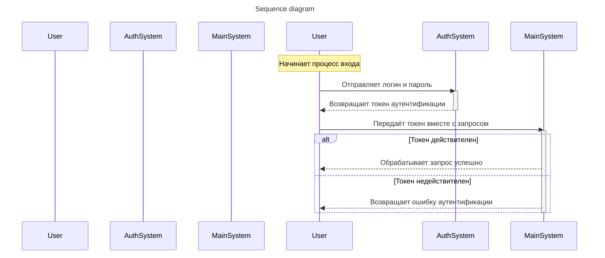
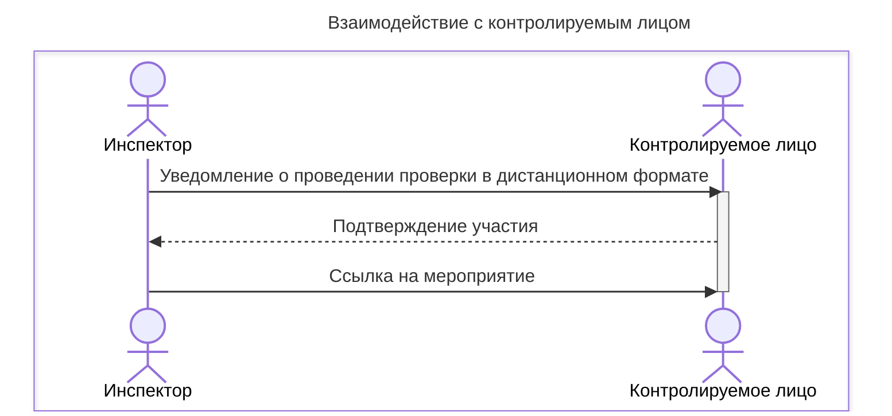

# Блок-схемы

```mermaid
---
title: Sequence diagram
---

sequenceDiagram
    participant Пользователь as User
    participant СистемаАвторизации as AuthSystem
    participant ОсновнаяСистема as MainSystem

    Note over User: Начинает процесс входа

    User->>AuthSystem: Отправляет логин и пароль
    activate AuthSystem
    AuthSystem-->>User: Возвращает токен аутентификации
    deactivate AuthSystem

    User->>MainSystem: Передаёт токен вместе с запросом
    activate MainSystem
    alt Токен действителен
        MainSystem-->>User: Обрабатывает запрос успешно
    else Токен недействителен
        MainSystem-->>User: Возвращает ошибку аутентификации
    end
    deactivate MainSystem

```

## knd

```mermaid
---
title: Взаимодействие с контролируемым лицом
config:
    theme: default
---
sequenceDiagram
        
    box
        actor Inspector as Инспектор
        actor Organization as Контролируемое лицо
    end
    Inspector->>Organization: Уведомление о проведении проверки в дистанционном формате
    activate Organization
        Organization-->>Inspector: Подтверждение участия
        Inspector->>Organization: Ссылка на мероприятие
    deactivate Organization
```